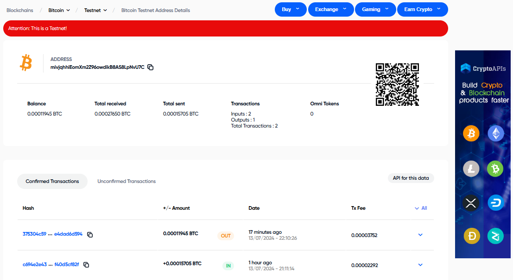
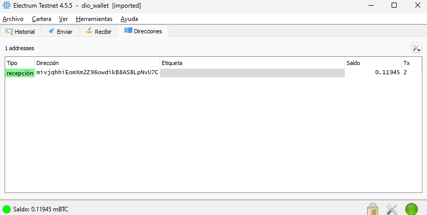
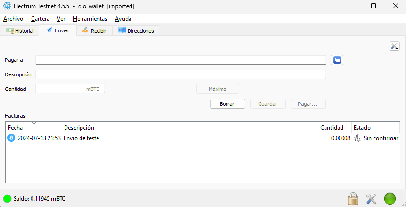
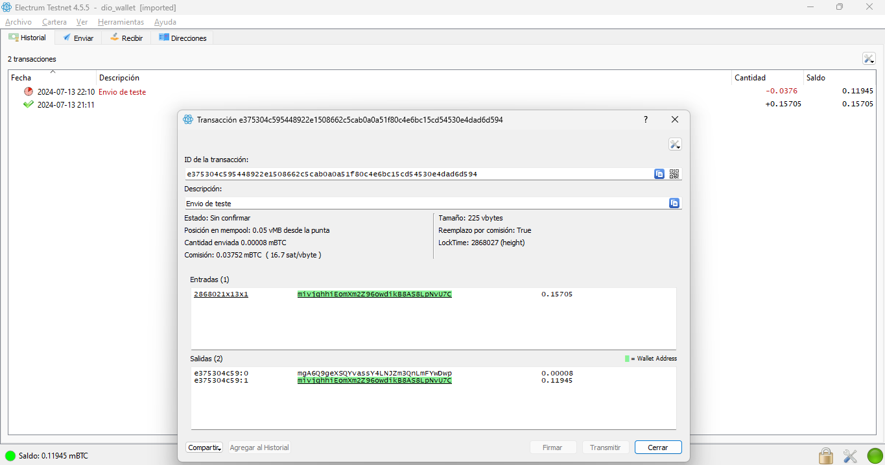

### Descrição do Desenvolvimento

Este projeto implementa a geração de uma carteira de Bitcoin na rede de testes (testnet) utilizando várias bibliotecas de JavaScript especializadas em criptografia e Bitcoin. A seguir, está resumido os principais passos realizados durante o desenvolvimento:

1. **Importação de Dependências**:
   - Foram utilizadas as bibliotecas `bip32` para derivação de chaves hierárquicas, `bip39` para geração de mnemônicos e `bitcoinjs-lib` para operações com Bitcoin.

2. **Definição da Rede**:
   - Foi especificado o uso da rede de testes do Bitcoin (`testnet`), permitindo realizar testes sem utilizar Bitcoin real.

3. **Geração do Mnemônico**:
   - Foi gerado um mnemônico aleatório que atua como uma frase de segurança para a carteira.

4. **Conversão do Mnemônico em Seed**:
   - O mnemônico foi convertido em uma seed (semente), que é utilizada para gerar a carteira HD (Hierarchical Deterministic).

5. **Criação da Raiz da Carteira HD**:
   - A partir da seed e da rede especificada, foi criada a raiz da carteira HD.

6. **Derivação de uma Conta**:
   - Da raiz da carteira, foi derivada uma conta específica utilizando um caminho de derivação predefinido.

7. **Obtenção das Chaves Públicas e Privadas**:
   - Foi derivado um nó específico da conta para obter as chaves pública e privada.

8. **Geração do Endereço de Bitcoin**:
   - Utilizando a chave pública do nó e a rede especificada, foi gerado um endereço de Bitcoin.

9. **Impressão das Informações da Carteira**:
   - Finalmente, foram impressos no console o endereço de Bitcoin, a chave privada e o mnemônico gerado.

10. **Importação da Carteira no Electrum**:
    - A carteira gerada foi importada no Electrum, um software de carteira Bitcoin, para verificar a funcionalidade e autenticidade.

11. **Teste da Endereço em Exploradores de Blocos**:
    - O endereço gerado foi testado nos exploradores de blocos [BlockCypher](https://live.blockcypher.com/) e [BlockExplorer](https://blockexplorer.one/) para garantir que a carteira e o endereço funcionam corretamente na rede de testes.

```markdown

```

12. Se uso no processo de teste da carteira, a recepção de satoshis desde faucets de testnet para Bitcoin.

### Instruções de Importação e Teste

Para importar a carteira gerada e testar o endereço:

1. **Importar a Carteira no Electrum**:
   - Abra o Electrum e selecione a opção para importar uma carteira.
   - Insira o mnemônico gerado pelo script.
   - Verifique se a carteira é carregada corretamente e o endereço coincide com o gerado pelo script.

2. **Testar o Endereço nos Exploradores de Blocos**:
   - Acesse [BlockCypher](https://live.blockcypher.com/) ou [BlockExplorer](https://blockexplorer.one/).
   - Insira o endereço gerado no campo de busca para verificar a existência e detalhes do endereço na rede de testes.

### Formato para Inserir Fotos em Markdown

Para inserir imagens no seu README.md, utilize o seguinte formato:

```markdown

```
```markdown

```
```markdown

```

Este projeto fornece uma maneira prática e segura de gerar carteiras de Bitcoin na rede de testes, facilitando o desenvolvimento e teste de aplicações relacionadas ao Bitcoin.
